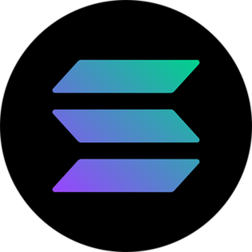
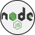
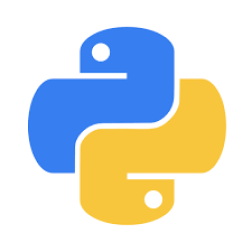
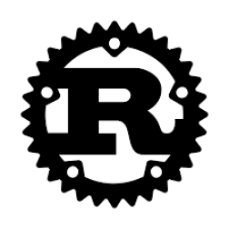
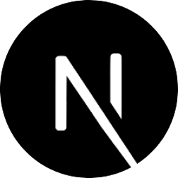
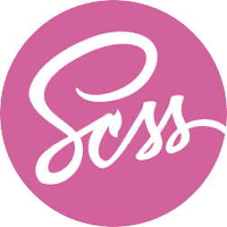
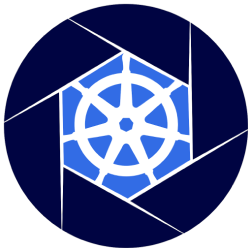
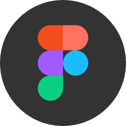

<h1 align="center"> 一═⌊✪⌋Sr. Blockchain & Full Stack Dev⌊✪⌋═一
</h1>
<!--  -->

## 👨‍💻 About Me:

### I'm a blockchain expert with over 10 years of experience designing and developing decentralized applications (dApps), smart contracts, and blockchain integrations. I specialize in Ethereum, Solidity, Hyperledger, and Layer-2 solutions, with extensive experience in building DeFi systems, designing tokenomics, and improving blockchain scalability and security.  In addition to my blockchain expertise, I'm proficient in Python and skilled in both front-end and back-end development, enabling me to deliver seamless, full-stack solutions.

## 🔥Statistics

	
	
	

 

    <table>
		<td>
		

			<code></code>
			<code></code>
			<code></code>
			<code></code>
			<code></code>
			<code></code>
			  
			<code></code>
			<code></code>
			<code></code>
			<code></code>
			<code></code>
			<code></code>
			  
			<code></code>
			<code></code>
			<code></code>
			<code></code>
			<code></code>
			<code></code>
			  
			<code></code>
			<code></code>
			<code></code>
			<code></code>
			<code></code>
			<code></code>
		

		</td>
		<td></code></td>
    </table>

 

	

		<a target="_blank"href="https://www.gitpoap.io/gp/893">&nbsp&nbsp
		<a target="_blank"href="https://www.gitpoap.io/gp/879">&nbsp&nbsp
		<a target="_blank"href="https://poap.gallery/event/128736">&nbsp&nbsp
		<a target="_blank" href="https://collectors.poap.xyz/en-US/token/6673781">
	

	

	
	

